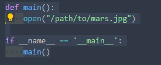
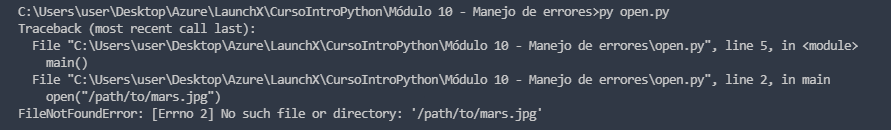
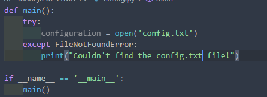
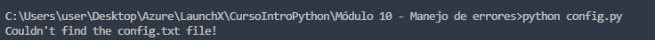
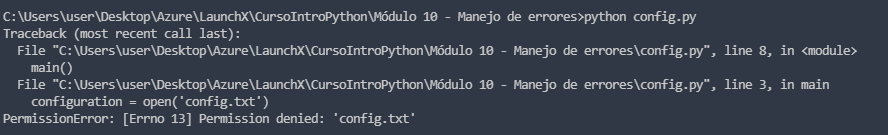
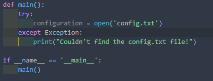
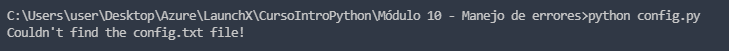
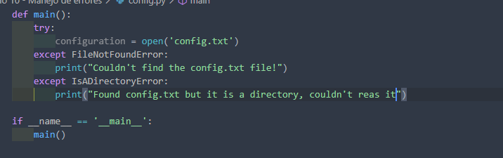
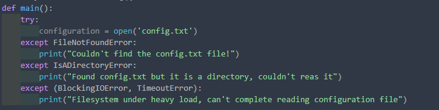

# Resultado de ejecutar open.py

### Codigo del archivo

### Resultado en consola

# Try y Except con config.py

### Codigo del archivo primer intento

### Resultado primero ejecución

### Resultado segunda ejecución

### Modificación codigo

### Resultado de ejecución

### Modificación para permisos y directorios

### Ejecución para excepción de permisos

### Ultima modificación

