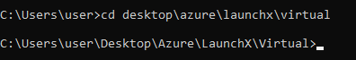
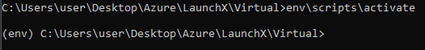
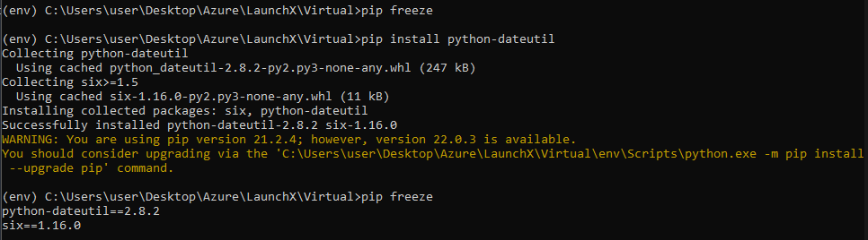
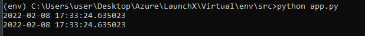

# Crear un entorno Virtual

**1.- En este caso me dirijo al directorio donde se creara el entorno virtual**

**2.- Comando para crear el entorno virtual**

**3.- Activación del entorno virtual**

**4.- Instalación de una biblioteca y mostrar lista**

**5.- Desactivar entorno Virtual**

# Ejecutar un programa en un entorno virtual

